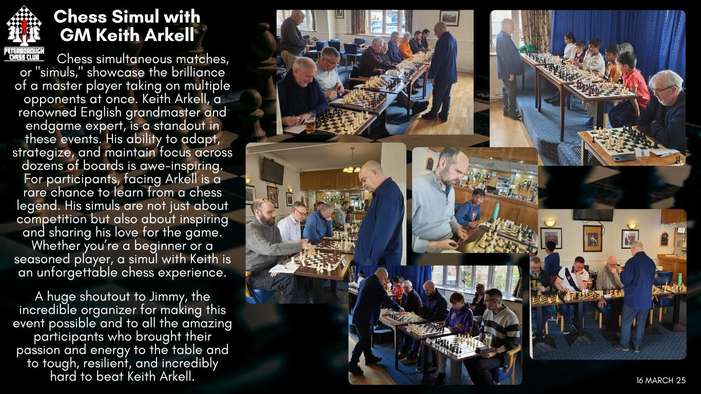

# Keith Arkell GM Simultaneous Exhibition Match
### 16 March, 2025

## Study Overview
[📚 View Full Study on Lichess](https://lichess.org/study/9GRD75wl)

## Contents

1. [**Frederick Fairhurst** - GM K. Arkell](#game-1) - **1-0**
2. [**Sudarsan Prabhagar** - GM K. Arkell](#game-2) - **0-1**
3. [**Yugan Suganya** - GM K. Arkell](#game-3) - **0-1**
4. [**Kavishwar Arunkumar** - GM K. Arkell](#game-4) - **0-1**
5. [**Brendan Rooney** - GM K. Arkell](#game-5) - **0-1**
6. [**Hubert Neumaier** - GM K. Arkell](#game-6) - **0-1**
7. [**John Bell** - GM K. Arkell](#game-7) - **0-1**
8. [GM K. Arkell - **Claude Masseron**](#game-8) - **½-½**
9. [GM K. Arkell - **David McClennon**](#game-9)
10. [**Nagarajun Gopinathan** - GM K. Arkell](#game-10) - **0-1**
11. [GM K. Arkell - **Steve Fairhurst**](#game-11) - **1-0**
12. [**Allan MacLeod** - GM K. Arkell](#game-12) - **0-1**
13. [**Douglas Redden** - GM K. Arkell](#game-13) - **0-1**
14. [GM K. Arkell - **Jimmy Blair**](#game-14) - **1-0**
15. [**Andrew Neville** - GM K. Arkell](#game-15) - **0-1**
16. [GM K. Arkell - **Leo Galea**](#game-16) - **1-0**
17. [GM K. Arkell - **Marek Zajaczkowski**](#game-17) - **1-0**
18. [**Alan Brookbanks** - GM K. Arkell](#game-18) - **0-1**

## Individual Games

### Frederick Fairhurst - GM K. Arkell - **1-0**
<iframe src="https://lichess.org/study/embed/9GRD75wl/dAa6agPL?theme=auto&bg=auto" width=600 height=469 frameborder=0></iframe>

### Sudarsan Prabhagar - GM K. Arkell - **0-1**
<iframe src="https://lichess.org/study/embed/9GRD75wl/B0Ag34xS?theme=auto&bg=auto" width=600 height=469 frameborder=0></iframe>

### Yugan Suganya - GM K. Arkell - **0-1**
<iframe src="https://lichess.org/study/embed/9GRD75wl/jz8Y6d0w?theme=auto&bg=auto" width=600 height=469 frameborder=0></iframe>

### Kavishwar Arunkumar - GM K. Arkell - **0-1**
<iframe src="https://lichess.org/study/embed/9GRD75wl/feSdSc0i?theme=auto&bg=auto" width=600 height=469 frameborder=0></iframe>

### Brendan Rooney - GM K. Arkell - **0-1**
<iframe src="https://lichess.org/study/embed/9GRD75wl/eB5WDC4Q?theme=auto&bg=auto" width=600 height=469 frameborder=0></iframe>

### Hubert Neumaier - GM K. Arkell - **0-1**
<iframe src="https://lichess.org/study/embed/9GRD75wl/pPVKfjBg?theme=auto&bg=auto" width=600 height=469 frameborder=0></iframe>

### John Bell - GM K. Arkell - **0-1**
<iframe src="https://lichess.org/study/embed/9GRD75wl/x6YiEFv6?theme=auto&bg=auto" width=600 height=469 frameborder=0></iframe>

### GM K. Arkell - Claude Masseron - **½-½**
<iframe src="https://lichess.org/study/embed/9GRD75wl/LdR4jiPy?theme=auto&bg=auto" width=600 height=469 frameborder=0></iframe>

### GM K. Arkell - David McClennon
<iframe src="https://lichess.org/study/embed/9GRD75wl/kyKd4yC0?theme=auto&bg=auto" width=600 height=469 frameborder=0></iframe>

### Nagarajun Gopinathan - GM K. Arkell - **0-1**
<iframe src="https://lichess.org/study/embed/9GRD75wl/NSthX2L5?theme=auto&bg=auto" width=600 height=469 frameborder=0></iframe>

### GM K. Arkell - Steve Fairhurst - **1-0**
<iframe src="https://lichess.org/study/embed/9GRD75wl/3UTfqRGf?theme=auto&bg=auto" width=600 height=469 frameborder=0></iframe>

### Allan MacLeod - GM K. Arkell - **0-1**
<iframe src="https://lichess.org/study/embed/9GRD75wl/ITKnFfbq?theme=auto&bg=auto" width=600 height=469 frameborder=0></iframe>

### Douglas Redden - GM K. Arkell - **0-1**
<iframe src="https://lichess.org/study/embed/9GRD75wl/0VRrxLwv?theme=auto&bg=auto" width=600 height=469 frameborder=0></iframe>

### GM K. Arkell - Jimmy Blair - **1-0**
<iframe src="https://lichess.org/study/embed/9GRD75wl/AShXoD9N?theme=auto&bg=auto" width=600 height=469 frameborder=0></iframe>

### Andrew Neville - GM K. Arkell - **0-1**
<iframe src="https://lichess.org/study/embed/9GRD75wl/Y7vsRtpc?theme=auto&bg=auto" width=600 height=469 frameborder=0></iframe>

### GM K. Arkell - Leo Galea - **1-0**
<iframe src="https://lichess.org/study/embed/9GRD75wl/jzB9eT1L?theme=auto&bg=auto" width=600 height=469 frameborder=0></iframe>

### GM K. Arkell - Marek Zajaczkowski - **1-0**
<iframe src="https://lichess.org/study/embed/9GRD75wl/v0TKEd7E?theme=auto&bg=auto" width=600 height=469 frameborder=0></iframe>

### Alan Brookbanks - GM K. Arkell - **0-1**
<iframe src="https://lichess.org/study/embed/9GRD75wl/1d1ygONG?theme=auto&bg=auto" width=600 height=469 frameborder=0></iframe>

---
