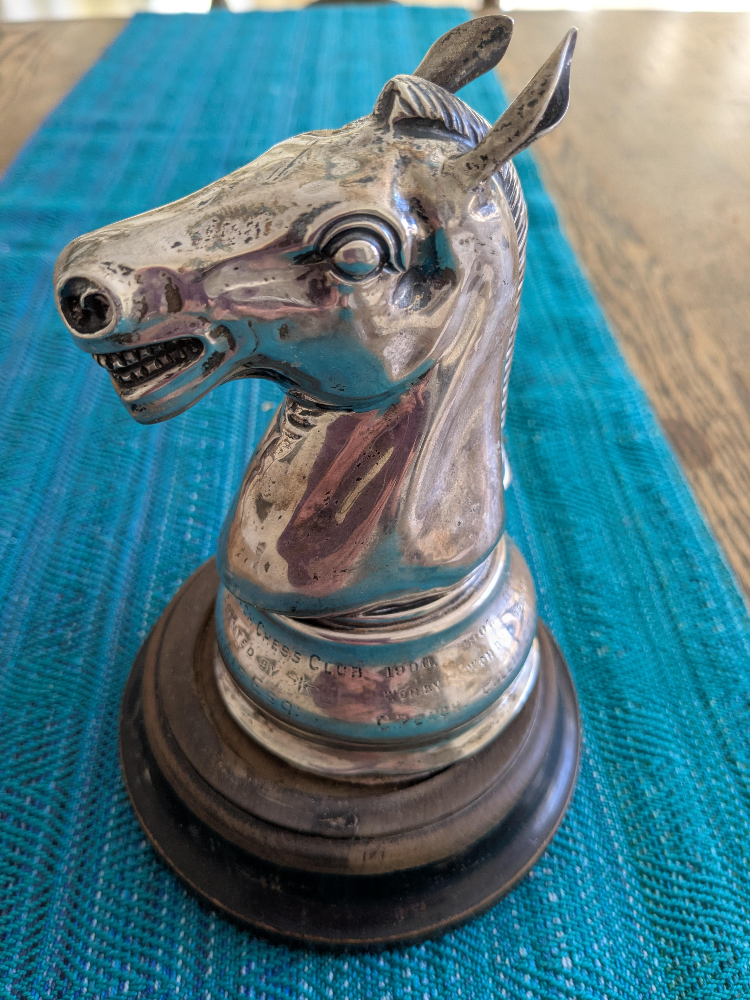

## Early history
{ align=right }
Peterborough Chess Club was founded at The Bedford Coffee House on August 30th. 1893, by Mr S. Shrive, Mr. Henry Hare and Mr. Burlingham. Mr. T. Andrews of Lincoln Road was elected as the first President.

The idea for a chess club was first mentioned Wednesday 10 May 1893.  "It is proposed to form a chess club for the city for the ensuing season. Gentlemen willing to join are invited to send their names to Mr. Hy. Hare, Narrow Street. "

Wednesday 05 September 1894.  Peterborough Chess Club.—The annual meeting of the members of the Peterborough Chess Club was held at the "Bedford" on Monday evening, Mr. Symonds occupying the chair. { width=250 align=right } The Secretary, in reading the report for the put season said that after paying all expenses, they had a balance in hand of lOs. 9d. Four matches had been played, three lost and one won. He also said that in presenting their first annual report, the committee congratulated the members on the fact of a chess club having been successfully started in Peterborough, as it had been the means of bringing together many chess players who previously had but little opportunity for practice. 

The following officers were elected.—President, Mr. Sharpe; Vice-president, Mr. Symonds; Hon. Sec., Mr. Hare ; Match Captain, Mr. Burlingham ; and the committee : Marrs. Mason, Shrive, Neal, Mitchinson, Mc Kerrow, F. Starton, and Perkins. The meeting closed with a vote of thanks to the Chairman.

The chess club then moved to the Grand Hotel in the early 1900s 
{width=400}

{ align=left }

## Eminent chess players

### Mr. Samuel Shrive
{ align=left }
Peterborough Standard, Friday 08 November 1929, AN OLD AND POPULAR TRADESMAN. ---*-- Death of Mr. Samuel Shrive, of Peterborough. , MEMORIES OF THE GOLD DIGGINGS. Many of the citizens of Peterborough feel a deep sense of loss in the death of Mr. Samuel Shrive. "Abbotsford," Park, road, who might be termed Grand Old Man of the city. His demise occurred suddenly. Whilst listening in to a broadcast, lecture on Saturday evening he complained of soddenly feeling unwell, and his medical advisor, Dr. J. Filcher, was called. After a time he appeared to be in less pain. awl the doctor left. However, he became worse. and though Dr. Filcher was hastily recalled again, Mr. Shrive passed away. Mr. Shrive, who was 88, had lived a very full and varied life. A son of the late Mr. and Mr. John Shrive was born in a hamlet near Finedon, and when he was quite young parents moved to Stonepit Lodge, between Wood Newton and Fotheringhay. There he spent the whole of his boyhood, being educated at Berridge's School. Among his contemporaries at that scholastic institution were such well-known men as the late Alderman John Tebbutt and the lute Mr. Thomas Stokes, of Warmington. In Mr. Shrive came to Peterborough. was apprenticed by Mr. William Thompson, of Bridge-street, whose premises occupied the site where Messrs. Shrive and Son's establishment now stands. Later he joined Mr. Searjeant, whose business he worked with the late Alderman Daniel Redhead! Later Mr. Joseph Searjeant took over the business and took Mr. Redhead in partnership with him. As a young man of twenty. Mr. Shrive turned. his attention to the then rapidly developing British colonies in the Far East. He decided to try his luck in New Zealand and sailed from England in one of the old-time wind-jammers. The journey took three months. and Mr. Shrive was often told how he whiled away many weary booms with his beloved set of chess-men. When he landed in Dunedin he had to sell his chess set and even his pipe and tobacco to pay his quota fees. Those were the days of the gold erase in New Zealand, and Mr. Shrive joined the beetle rush northward across the South Island to Hokitika—in those days it was a settlement of wooden huts. Today Hokitika is in.. one of the five great cities of South Island. He made the journey on foot and by pack horse, and often had to cut his way through dense thickets. Mr. Shrive was among the hundreds of prospectors who flocked to the gold fields and staked their claims, but he was not to have the luck to be among the few to "make, their pile." He next turned his attention to cattle ranching, and many are the tales he told of the exciting days of his stock-riding. 

BACK TO THE HOMELAND. After a time he decided to return to the Motherland for a holiday, but he was destined never to return to New Zealand. In England, he met and married Miss Prior, of Brandon, Norfolk, and decided, that he would settle in Peterborough. He purchased the business of his one-time employer, Mr. Thompson. In a short time, the business developed to remarkable proportions, and Mr. Shrive was one of the city's best-known butchers. With two others he was instrumental in forming the Peterborough District Butchers' Association and was appointed treasurer. That office he held for a great many years, until, on the amount of his advancing age, he reluctantly decided to sever his connection with the association five years ago. In conjunction with the late Mr. Henry Hare and Mr. Burlingham, he founded the Peterborough Chess Club quite 40 years ago. He held principal offices in that society and came to be known as one of the best exponents of chess in Northamptonshire. He often represented the county in important matches. He was a well-known figure at the Church Institute, and it was his custom to visit the games room at about six in the evening, arrange the chessmen on the board, and then sit patiently smoking his pipe, waiting for the victim to appear!

### Mr. William John Cracknell
THE CATHEDRAL. with regret that we record the passing Mr. William John Cracknell. of 5, Manor House-street, on Saturday, at the age of 66 years. Mr. Cracknell, who was the only brother of the late Mr. John Cracknell, the former Peterborough building contractor, had patiently borne an illness of low, came to live in Peterborough about thirty years ago, and for the past 21 years had made his home in Manor House - Street. Of a quiet and kindly disposition, he had a host of friends and was one of the best-known members of the Peterborough Church Institute, and the Chess Club. His favourite pastime was chess, at which he was a recognised exponent. His. other interests included the Peterborough Museum Society), and he did elocution contests at the Memorial Hall. One of his greatest friends was the late Mr. S. Shrive. who predeceased him by two years. The funeral took place on Wednesday- day, at Lakenheath, Suffolk, in which village Mr. Cracknell was born, his father had farmed there for many years. The service at the Baptist Chapel was conducted by the Rev. E. Cooper. the principal mourners were Mrs. John Cracknell (sister-in-law). Mr. and Mrs. W. R. Cracknell, Mr. . and Mrs. J.H Cracknell, Miss Kathleen Cracknell (nephews and nieces), Mr. Ray and Felix Bean (directors of John Cracknell, . Ltd.), Mrs. Gray and Mr. Gilbey. Laken- heath friends).

## Chess competitions

{ align=left }

This cup was presented to the winner of the chess championship each year.  The knight is engraved with " Peterborough Chess Club". Presented by R.S.P ARRIS Esc. 1906 won by C. Peach. 1907 won by Collin. 1908 won by C.Peach. 1909 won by Dr. Smith. 1910 won by F.Mason. 1911 won by S. Shrive. 1912 won by A.C. Hawley. It was told that if you won the trophy 3 years in a row it was yours to keep. The last winner was Arthur Charles Hawley and he lived on Park Avenue in Peterborough.  The cup currently resides with Chris Hawley (Grandson of Arthur Charles Hawley) at his home in Colorado USA

## Peterborough Chess Club Advert in the Peterborough Standard
Friday 19 November 1937.  CHESS A FREE OFFER. The Peterborough Chess Club will be opened free to lovers of chess every Tuesday; evening for the next. six months Visitors will be: made welcome and it is hoped many will come and enjoy a friendly game with the members. The chess room which has just been redecorated and is well furnished, is easily found by entering the first doorway on the right in the Minster Precincts.
